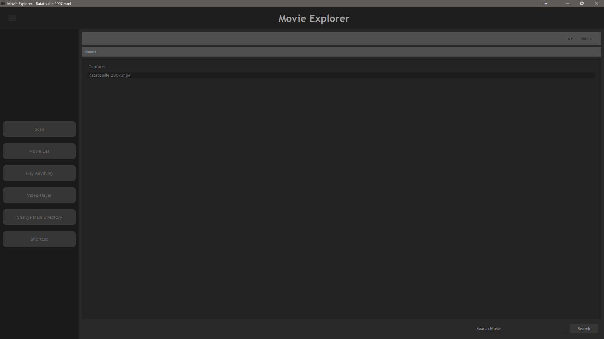
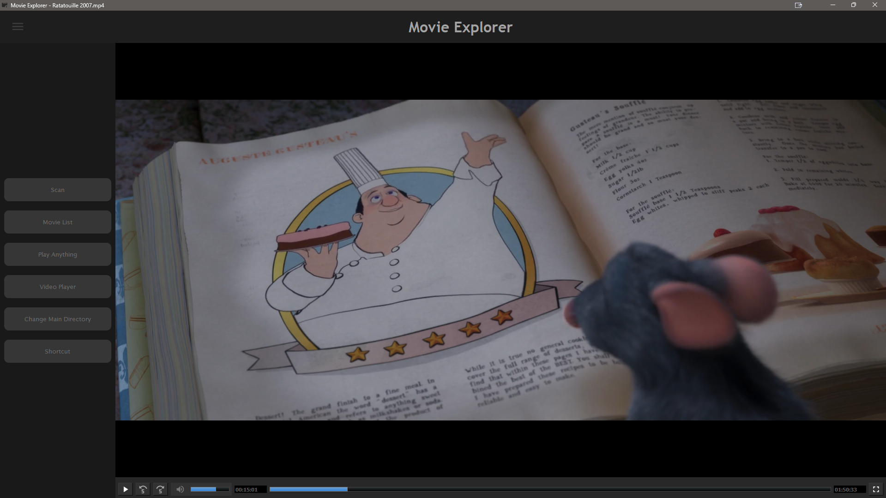

# Movie Explorer

Movie Explorer is a Python-based desktop application that helps you organize and play your movie collection. It features a modern user interface built with PyQt5, providing an intuitive way to browse through your movie folders and play videos with a custom video player.

## Features

- Browse through movie folders and subfolders
- Custom video player with modern controls
- Search functionality for quick movie access
- Random movie selection
- Keyboard shortcuts for easy navigation
- Support for various video formats
- Fullscreen mode with auto-hiding controls
- Volume control with keyboard and mouse wheel

## Screenshots

### Movie List View


### Video Player


## Installation and Setup

Follow these steps to get Movie Explorer up and running on your system:

1. **Clone the Repository**
   ```bash
   git clone https://github.com/johnandrewsanvictores/movie_explorer.git
   cd movie_explorer
   ```

2. **Install Python Dependencies**
   ```bash
   pip install -r requirements.txt
   ```

3. **Install K-Lite Codec Pack**
   - Download K-Lite Codec Pack Standard from [here](https://codecguide.com/download_k-lite_codec_pack_standard.htm)
   - Run the installer and follow the installation wizard
   - This codec pack is required for proper video playback support

4. **Run the Application**
   ```bash
   python main.py
   ```

## Keyboard Shortcuts

- `s` - Scan Movies
- `l` - See Movie List
- `r` - Play Random
- `c` - Change Main Directory
- `Ctrl + s` - Open Shortcut Window
- `Space` - Play/Pause
- `Double Click` - Toggle Fullscreen
- `Esc` - Exit Fullscreen
- `Mouse Wheel` - Adjust Volume
- `Shift + Up/Down Arrow` - Adjust Volume
- `Shift + Right/Left Arrow` - Forward/Rewind 5 seconds

## System Requirements

- Windows OS
- Python 3.6 or higher
- PyQt5
- K-Lite Codec Pack Standard
